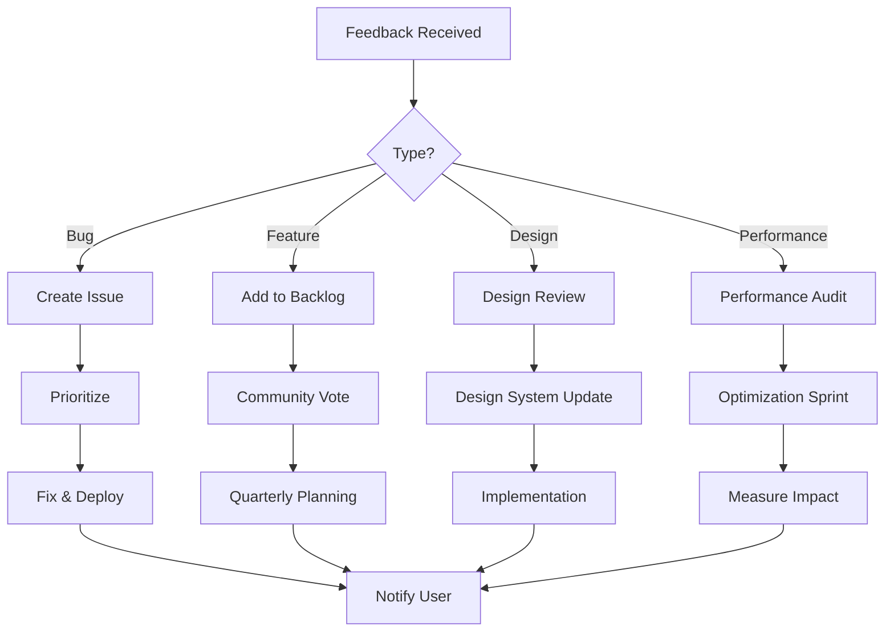

# User Feedback System

## Overview

A comprehensive system for collecting, analyzing, and acting on user feedback for Aion Visualization.

## Feedback Channels

### 1. GitHub Issues
- **Purpose**: Bug reports, feature requests, technical discussions
- **Template**: Use issue templates for consistency
- **Labels**: bug, enhancement, documentation, good first issue
- **Response Time**: Within 24 hours

### 2. Analytics Events
- **Purpose**: Behavioral insights, usage patterns
- **Collection**: Privacy-focused, no personal data
- **Metrics**: Page views, interaction events, performance data
- **Review**: Weekly dashboard review

### 3. In-App Feedback Widget
```javascript
// Simple feedback widget (to be implemented)
class FeedbackWidget {
  constructor() {
    this.createWidget();
  }
  
  createWidget() {
    const widget = document.createElement('div');
    widget.className = 'feedback-widget';
    widget.innerHTML = `
      <button class="feedback-trigger">Feedback</button>
      <div class="feedback-form hidden">
        <h3>Share Your Thoughts</h3>
        <textarea placeholder="How can we improve?"></textarea>
        <select>
          <option>General Feedback</option>
          <option>Bug Report</option>
          <option>Feature Request</option>
          <option>Design Feedback</option>
        </select>
        <button class="submit-feedback">Send</button>
      </div>
    `;
    document.body.appendChild(widget);
  }
}
```

### 4. Social Media Monitoring
- **Platforms**: Twitter, LinkedIn, Reddit
- **Tools**: Social media monitoring alerts
- **Response**: Engage within 4 hours
- **Tracking**: Spreadsheet of mentions and sentiment

### 5. Direct Communication
- **Email**: feedback@aion.design (when set up)
- **GitHub Discussions**: Community forum
- **Response Template**: Professional, helpful, timely

## Feedback Categories

### 1. Bug Reports
**Priority Levels**:
- **Critical**: Site breaking, data loss - Fix within 24h
- **High**: Major feature broken - Fix within 48h
- **Medium**: Minor feature issue - Fix within 1 week
- **Low**: Cosmetic issues - Next release

**Process**:
1. Acknowledge receipt
2. Reproduce issue
3. Create GitHub issue
4. Fix and test
5. Deploy and notify user

### 2. Feature Requests
**Evaluation Criteria**:
- Aligns with project vision
- Technical feasibility
- User demand (number of requests)
- Development effort
- Performance impact

**Process**:
1. Log in feature backlog
2. Discuss in GitHub Discussions
3. Community voting
4. Quarterly planning
5. Implementation and release

### 3. Design Feedback
**Considerations**:
- Accessibility impact
- Performance implications
- Consistency with design system
- User experience improvement
- Technical constraints

### 4. Performance Issues
**Metrics to Track**:
- Load time
- Frame rate
- Memory usage
- Bundle size
- Error rate

**Response**:
1. Measure and reproduce
2. Profile performance
3. Implement optimization
4. Verify improvement
5. Document changes

## Feedback Processing Workflow



## Response Templates

### Bug Report Acknowledgment
```
Thank you for reporting this issue! I really appreciate you taking the time to help improve Aion Visualization.

I've logged this as issue #[NUMBER] and will investigate it shortly. 

To help me fix this faster, could you please provide:
- Your browser and version
- Steps to reproduce the issue
- Expected vs actual behavior
- Screenshots if applicable

I'll keep you updated on the progress!
```

### Feature Request Response
```
Thanks for the fantastic suggestion! This is exactly the kind of feedback that helps make Aion Visualization better.

I've added this to our feature backlog for community discussion. You can follow the progress and vote for this feature at [LINK].

Features are prioritized based on:
- Community interest
- Technical feasibility
- Alignment with project goals

I'll update you when this moves forward!
```

### Positive Feedback Response
```
Thank you so much for the kind words! It's incredibly motivating to hear that Aion Visualization is providing value.

If you have any suggestions for improvements or features you'd like to see, I'd love to hear them.

Also, if you're enjoying the project, consider:
- Starring on GitHub
- Sharing with others who might find it useful
- Contributing to the codebase

Thanks again for your support!
```

## Metrics & Reporting

### Weekly Metrics
- Total feedback received
- Response time average
- Issues resolved
- Features requested
- User satisfaction score

### Monthly Report
- Trend analysis
- Popular feature requests
- Common pain points
- Performance improvements
- Community growth

### Quarterly Review
- Major features shipped
- User satisfaction trends
- Technical debt assessment
- Roadmap adjustments
- Success stories

## Feedback-Driven Development

### Principles
1. **User-Centric**: Every decision considers user impact
2. **Transparent**: Open roadmap and progress
3. **Iterative**: Quick releases based on feedback
4. **Data-Driven**: Decisions backed by metrics
5. **Community**: Users shape the product

### Implementation Cycle
1. **Collect**: Gather feedback from all channels
2. **Analyze**: Identify patterns and priorities
3. **Plan**: Create implementation strategy
4. **Build**: Develop with quality focus
5. **Test**: Ensure fixes work properly
6. **Deploy**: Release improvements
7. **Measure**: Track impact of changes
8. **Iterate**: Continuous improvement

## Tools & Infrastructure

### Feedback Management
- GitHub Issues: Bug tracking
- GitHub Discussions: Community forum
- Analytics Dashboard: Usage insights
- Social Media Tools: Mention tracking

### Communication
- Email templates: Consistent responses
- Status page: Uptime and issues
- Changelog: Document all changes
- Blog: Major updates and insights

### Automation
```javascript
// Example: Auto-label GitHub issues
const labelIssue = (issue) => {
  const title = issue.title.toLowerCase();
  const body = issue.body.toLowerCase();
  
  const labels = [];
  
  if (title.includes('bug') || body.includes('error')) {
    labels.push('bug');
  }
  if (title.includes('feature') || body.includes('request')) {
    labels.push('enhancement');
  }
  if (body.includes('performance') || body.includes('slow')) {
    labels.push('performance');
  }
  
  return labels;
};
```

## Best Practices

### Do's
- Respond quickly and professionally
- Be transparent about limitations
- Thank users for their time
- Follow up on resolutions
- Share credit with contributors

### Don'ts
- Dismiss feedback as "works for me"
- Make promises you can't keep
- Ignore negative feedback
- Implement without considering impact
- Forget to document changes

## Success Stories Template

Share user success stories to build community:

```markdown
## Success Story: [User/Organization]

**Challenge**: What problem were they solving?

**Solution**: How did Aion Visualization help?

**Result**: What was the outcome?

**Quote**: "Direct quote from user"

**Lesson**: What we learned from this
```

---

Remember: Every piece of feedback is a gift. Users who take time to share their thoughts are invested in making the project better. Treat them as partners in creating something extraordinary.